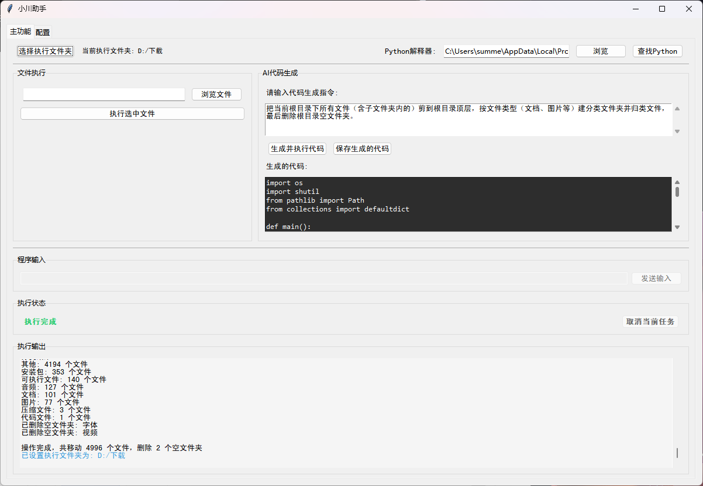

# RivAssist
commands. From deleting empty folders, renaming files, and resizing images to organizing files by format, its capabilities are entirely determined by your language descriptions, making file management more efficient.

小川助手 是一个由 AI 自动生成的工具，旨在通过自然语言指令批量快捷地操作电脑文件。无论是批量删除空文件夹、修改文件名、调整图片尺寸，还是按格式归类文件，它能实现的功能完全由你的语言描述决定，让文件管理更高效。

小川助手 使用教程

1. 安装 Python
操作：从 Python 官网 下载对应系统版本，安装时勾选「Add Python to PATH」
代码初次使用会执行一次运行环境检查。

3. 设置大语言模型 API
准备：获取大语言模型 API 密钥（如 OpenAI、阿里云通义千问等平台的 API Key）
配置：打开项目设置 API 密钥 URL等，保存文件

4. 打包代码
pyinstaller --onefile --collect-all tkinter --collect-all tcl -w RivAssist.py 打包文件

4.发送指令操作电脑
使用：在输入框发送自然语言指令（示例）：

批量删除「D:/ 文档」下的空文件夹

批量将「E:/ 图片」的所有图片修改为 800x600 尺寸

按格式整理「F:/ 下载」的文件（文档放 Docs 文件夹，视频放 Videos 文件夹）

执行：点击「生成并运行」，工具会自动生成代码并完成操作

注意事项
API 密钥需妥善保管，避免泄露
操作系统文件时，确保有对应文件夹的读写权限
项目实例：

